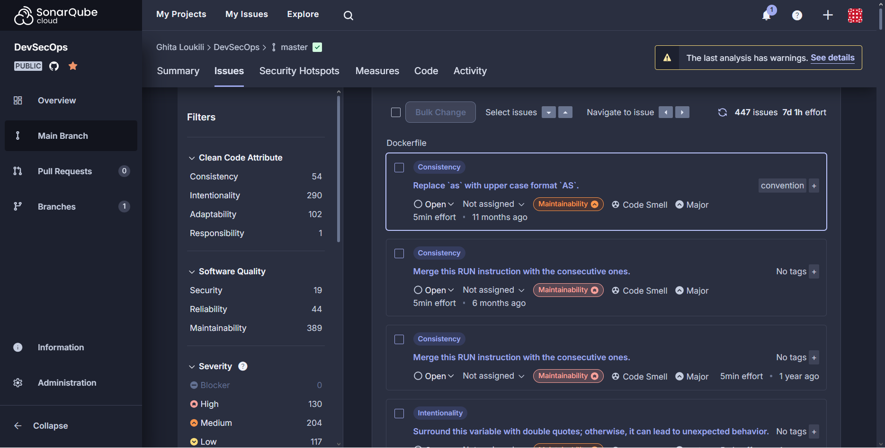
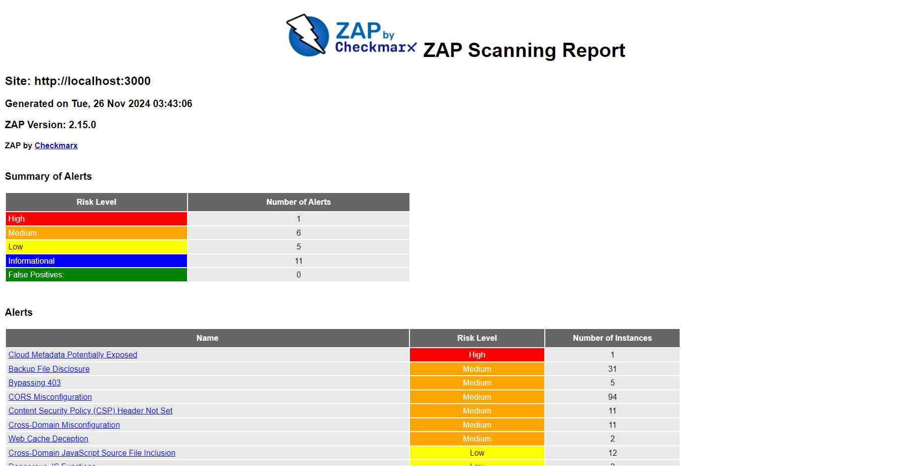

#  DevSecOps CI/CD Pipeline for OWASP Juice Shop

This lab aims to create a CI/CD pipeline for the [OWASP Juice Shop](https://github.com/juice-shop/juice-shop) using GitHub Actions. Juice Shop is a vulnerable web application ideal for security training. The goal is to automate deployment, integrate security testing through DevSecOps, and visualize vulnerability findings. The pipeline is implemented using **GitHub Actions** and integrates **security testing**, **vulnerability management**, and **automated redeployment**.

## Pipeline Overview
1. **Continuous Integration/Deployment (CI/CD):**
   - Automates the deployment of the Juice Shop Docker image.
   - Verifies the health and accessibility of the deployed application.

2. **Integrated Security Testing:**
   - **SAST**: Uses [CodeQL](https://github.com/github/codeql) for static code analysis.
   - **SCA**: Uses [Snyk](https://snyk.io/) to scan for vulnerabilities in dependencies.
   - **DAST**: Employs [OWASP ZAP](https://www.zaproxy.org/) to perform runtime security tests.
   - Uploads security results as artifacts.

3. **Vulnerability Management:**
   - Combines and processes results into SARIF & XML reports.
   - Integrates with [SonarCloud](https://sonarcloud.io/).

4. **Automated Redeployment:**
   - Redeploys Juice Shop after codebase changes or vulnerability fixes.

---
## Security Analysis Steps
The pipeline integrates security testing to ensure that vulnerabilities are identified and managed at different stages of the software development lifecycle. Below is a detailed explanation of each security analysis stage:

### 1. Static Application Security Testing (SAST)
 - Purpose: Analyze source code and identify security vulnerabilities without executing the application.
 - Tool Used: CodeQL
 -  Steps:
       - Set up the CodeQL environment and specify the language (javascript) and query suite (security-extended).
       - Automatically configure and build the project for analysis.
       - Run CodeQL queries to generate a detailed report of vulnerabilities in the source code.
       - Save the results as an artifact for further processing.
 -  Prerequisites:
       - Ensure the github/codeql-action/init and related actions are enabled.

### 2. Software Composition Analysis (SCA)
 - Purpose: Detect vulnerabilities in third-party dependencies and libraries.
 - Tool Used: Snyk
 - Steps:
      - Use npm install to ensure all project dependencies are available.
      - Execute snyk test to scan for known vulnerabilities in the dependencies.
      - Save the results as an artifact for further integration.
 - Prerequisites:
      - A Snyk account is required to generate the SNYK_TOKEN secret.
      - Ensure the Snyk CLI is properly set up in the pipeline.

### 3. Dynamic Application Security Testing (DAST)
 - Purpose: Identify vulnerabilities in the running application by simulating attacks and observing responses.
 - Tool Used: OWASP ZAP
 - Steps:
     - Deploy the Juice Shop application as a Docker container and ensure it is running.
     - Perform a full scan of the application using OWASP ZAP’s Docker image.
     - Save the scan results in XML format.
     - Save the report as an artifact for further processing.
 - Prerequisites:
     - Ensure Docker is installed and accessible in the pipeline.
     - The target application should be running and reachable on the specified port (e.g., http://localhost:3000).

### 4. Vulnerability Management
 - Purpose: Combine results from SAST, SCA, and DAST tools into a single report and integrate with SonarCloud for tracking and remediation.
 - Steps:
    - Retrieve analysis results from CodeQL, Snyk, and OWASP ZAP.
    - Merge the outputs into a single Sarif file for compatibility with SonarCloud.
    - Upload DAST reports using the sonar.zaproxy.reportPath parameter.
    - Upload SAST and SCA reports using sonar.sarifReportPaths.
    - Display the overall results and quality gate status.
 - Prerequisites:
    - Configure SonarCloud with SONAR_TOKEN, SONAR_PROJECT_KEY, and SONAR_ORGANIZATION secrets.
    - Ensure SonarCloud analysis is set up in the pipeline.
---

## Screenshots
- **SonarCloud Analysis**:
  
  

- **OWASP ZAP Report**:
   
  
